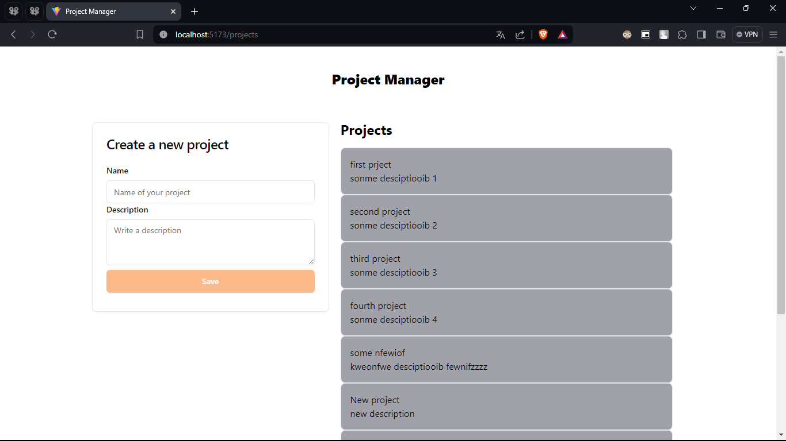
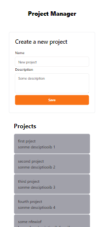
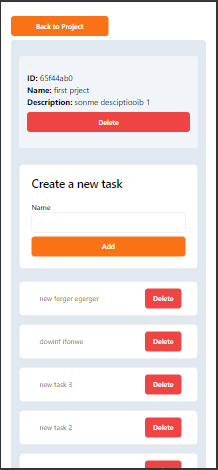

## MERN Graphql Web App Project Manager

### Web App Features

The web app allows users to create, delete, and manage projects. Users can perform the following actions related to project management:

- **Create Project**: Users can create new projects by providing a name and any additional details.
  
- **Delete Project**: Users have the ability to delete existing projects if they are no longer needed.

For each project created, users can manage a list of tasks associated with that project. The following functionalities are available for task management:

- **Create Task**: Within each project, users can create tasks to organize their work. Each task can have a title, description, due date, and other relevant details.

- **Update Task**: Users can edit task details such as the title, description, or due date as needed.

- **Delete Task**: Tasks can be deleted from the project's task list if they are completed or no longer relevant.

### Technologies
This project has been developed using the following technologies:

- **MongoDB**: For the NoSQL database.
- **Express.js**: For the backend server.
- **React.js**: For the user interface.
- **Node.js**: For the server runtime environment.
- **GraphQL**: For efficient data manipulation in the API.

### Features

1. **Complete MERN Integration**: The project utilizes the MERN stack (MongoDB, Express.js, React.js, Node.js) for full-stack web application development.
   
2. **GraphQL-based API**: A GraphQL-based API has been implemented for efficient data manipulation.

3. **Dynamic Data Management**: Using GraphQL, the application can efficiently manage data and client-specific queries.

4. **Responsive User Interface**: The user interface is developed with React.js, ensuring a responsive and user-friendly experience.

5. **Advanced Functionalities**: The project may include advanced functionalities such as user authentication, real-time data management, and other features as per project requirements.

### Main View

  

### Responsive View

  
  

